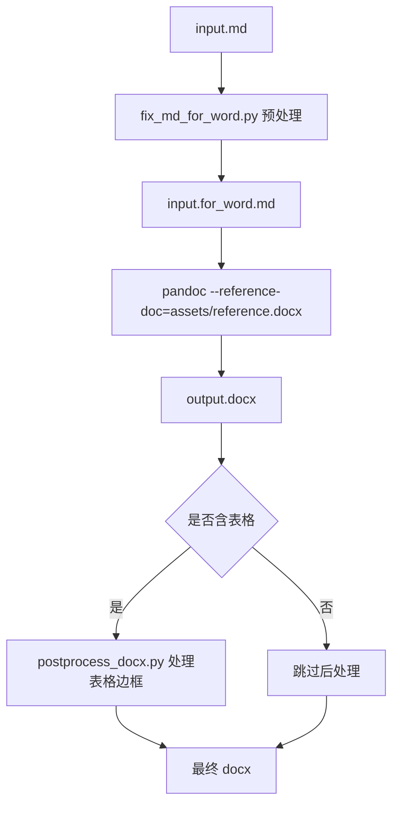

# Markdown 转 Word 技能

`skill-markdown-to-word` 是一个面向 Claude Code / OpenCode 的本地技能，用于把 Markdown 文档（`.md`）稳定转换为 Word 文档（`.docx`）。它基于 `Pandoc`，并叠加了 Python 预处理与后处理脚本，用来处理 Obsidian 风格图片引用、表格和 Word 样式模板。

GitHub 仓库地址：

```text
https://github.com/JasonCai2024/skill-markdown-to-word
```

克隆命令：

```bash
git clone https://github.com/JasonCai2024/skill-markdown-to-word.git
```

## 技能作用

相较于直接运行 `pandoc`，本技能额外解决这些问题：

1. Obsidian wiki 图片引用 `![[xxx.png]]` 不是标准 Markdown，直接转 Word 容易丢图。
2. Markdown 中嵌入的 HTML 表格，直接转 Word 后不一定能稳定变成可编辑表格。
3. Word 默认表格边框和标题样式不够稳定，需要统一模板与后处理。

## 架构与流程



## 目录结构

```text
skill-markdown-to-word/
├─ SKILL.md
├─ README.md
├─ INSTALL.md
├─ CHANGELOG.md
├─ .env.example
├─ .gitignore
├─ assets/
│  └─ reference.docx
├─ references/
│  └─ workflow.md
└─ scripts/
   ├─ convert_markdown_to_word.py
   ├─ fix_md_for_word.py
   ├─ postprocess_docx.py
   └─ build_reference_doc.py
```

## 获取与安装

先克隆仓库，再把整个 `skill-markdown-to-word/` 文件夹复制到技能目录中：

```bash
git clone https://github.com/JasonCai2024/skill-markdown-to-word.git
```

推荐安装路径：

| 工具 | 项目级路径 | 全局路径 |
| --- | --- | --- |
| Claude Code | `.claude/skills/skill-markdown-to-word/` | `~/.claude/skills/skill-markdown-to-word/` |
| OpenCode | `.claude/skills/skill-markdown-to-word/` | `~/.claude/skills/skill-markdown-to-word/` |

OpenCode 也支持 `.opencode/skills/` 与 `~/.config/opencode/skills/`，但仍建议优先放在 `.claude/skills/`，这样一份目录即可同时服务两个环境。

安装完成后，重启 Claude Code / OpenCode，或开启新会话，让技能重新被发现。

## 快速使用

```bash
python scripts/convert_markdown_to_word.py report.md
python scripts/convert_markdown_to_word.py report.md ./out/report.docx
python scripts/convert_markdown_to_word.py report.md --reference-doc ./my-template.docx
```

更完整的工作流和边界情况请看：

```text
references/workflow.md
```

## 凭证与安全

这个技能完全本地运行：

1. 不调用任何外部 API
2. 不需要账号、密码、Token
3. 只依赖系统里的 `Python 3` 和 `Pandoc`

`.env.example` 仅为统一模板保留，正常情况下无需填写。

安全规则：

1. 不要在脚本中硬编码任何凭证。
2. 不要提交真实 `.env` 文件。
3. 如果后续扩展出外部接口能力，需遵循 `E:\BaiduSyncdisk\WorkSpace\ForAgent\ClaudeCode标准技能生成规范.md` 中的凭证装载规则。

## 核心设计决策

1. 自带 `assets/reference.docx`，保证不同机器上的 Pandoc 输出样式尽量一致。
2. 用 `fix_md_for_word.py` 预处理 Markdown，而不是把复杂规则都塞进 Pandoc 参数。
3. 只在文档中确实存在表格时才做 DOCX 后处理，避免对纯文本文档产生额外风险。
4. 预处理输出单独的 `*.for_word.md` 临时文件，不覆盖原始 Markdown。
5. 本技能默认手动触发，不依赖自动加载。

## 兼容性

| 平台 | 技能发现路径 | 说明 |
| --- | --- | --- |
| Claude Code | `.claude/skills/`、`~/.claude/skills/` | 原生支持，命令名为 `/skill-markdown-to-word` |
| OpenCode | `.claude/skills/`、`~/.claude/skills/`、`.opencode/skills/`、`~/.config/opencode/skills/` | 可直接复用 Claude 兼容路径 |

## 相关文档

1. 安装说明：`INSTALL.md`
2. 更新记录：`CHANGELOG.md`
3. 工作流细节：`references/workflow.md`
