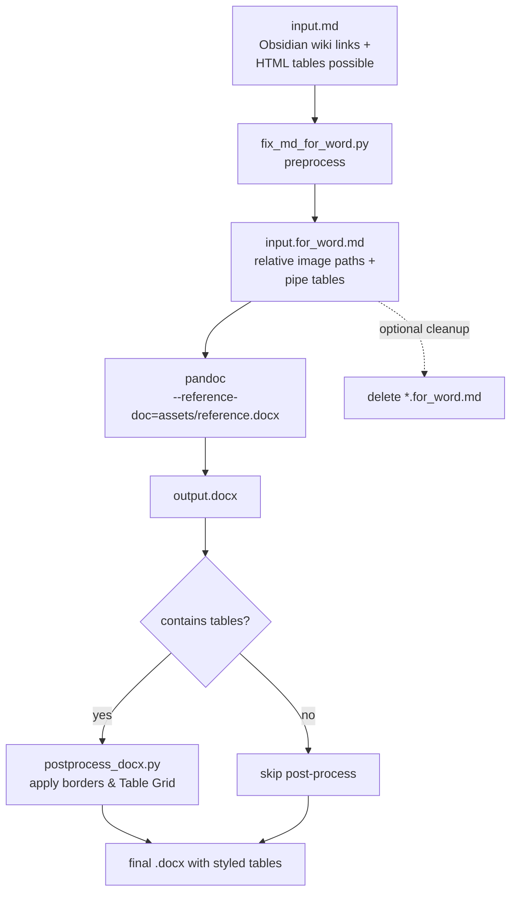

# Markdown To Word

A Claude Code / OpenCode skill that converts Markdown documents (`.md`) to Word documents (`.docx`) while preserving text, images, and tables as reliably as possible. The conversion is built on top of [Pandoc](https://pandoc.org/) with a Python pre-processor and a DOCX post-processor tuned for Obsidian-style Markdown.

## Why this skill

`pandoc` alone is enough for trivial Markdown, but it struggles with:

- **Obsidian wiki image links** like `![[20250919183015_1.png]]` — they are not standard Markdown.
- **HTML tables** embedded in Markdown — they often survive the conversion as inert HTML blocks that Word does not always render as real tables.
- **Word table styling** — Pandoc's default Word tables come out borderless and visually weak.

This skill wraps Pandoc with two small Python scripts that handle those three pain points deterministically.

## Architecture & Data Flow



## File Structure

```text
skill-markdown-to-word/
├─ SKILL.md                       # entry point for Claude Code / OpenCode
├─ README.md                      # this file (human-facing)
├─ INSTALL.md                     # install / copy / uninstall instructions
├─ .env.example                   # credential template (no real secrets)
├─ .gitignore                     # ignore .env, __pycache__/, etc.
├─ assets/
│  └─ reference.docx              # Pandoc reference style template
├─ references/
│  └─ workflow.md                 # detailed workflow & edge cases
└─ scripts/
   ├─ convert_markdown_to_word.py # one-shot CLI entry
   ├─ fix_md_for_word.py          # MD pre-processor
   ├─ postprocess_docx.py         # DOCX table styling
   └─ build_reference_doc.py      # regenerate reference.docx
```

## Get & Install

Clone or download this repository, then copy the entire `skill-markdown-to-word/` folder to one of these locations (per `INSTALL.md`):

| Tool         | Project-level path             | Global path                       |
| ------------ | ------------------------------ | --------------------------------- |
| Claude Code  | `.claude/skills/skill-markdown-to-word/` | `~/.claude/skills/skill-markdown-to-word/` |
| OpenCode     | `.claude/skills/skill-markdown-to-word/` | `~/.claude/skills/skill-markdown-to-word/` |

OpenCode also reads `.opencode/skills/` and `~/.config/opencode/skills/`, but using the Claude-compatible path is recommended so a single copy serves both tools.

Restart Claude Code / OpenCode (or start a new session) after copying so the skill is re-discovered.

For Claude Code manual invocation, you may also install a legacy command file at `~/.claude/commands/skill-markdown-to-word.md` to maximise the chance of seeing `skill-markdown-to-word` in the `/` completion list.

## Quick Start

```bash
# Minimal: produce output.docx next to input.md
python scripts/convert_markdown_to_word.py report.md

# Custom output path
python scripts/convert_markdown_to_word.py report.md ./out/report.docx

# Use a different reference style
python scripts/convert_markdown_to_word.py report.md --reference-doc ./my-template.docx
```

For the underlying shell pipeline (pandoc + pre-process + post-process) and edge cases, see `references/workflow.md`.

## Credential Security

This skill does **not** call any external API and does **not** ship with any credentials. It is fully local and depends only on:

- [Pandoc](https://pandoc.org/) (system install)
- Python 3.x (system install)

The `.env.example` file is included to comply with the repository template convention of the surrounding skill collection. Leave it empty unless you extend the skill with new credential-consuming steps.

Hard rules (enforced by `.gitignore`):

1. **Never** hard-code credentials inside the scripts.
2. **Never** commit a real `.env` file. The repo's `.gitignore` already excludes `.env`, `.env.local`, `.env.enterprise`, `__pycache__/`, and other local-only artefacts.
3. If you add a new feature that needs a secret, mirror the dynamic-loading pattern documented in `E:\BaiduSyncdisk\WorkSpace\ForAgent\ClaudeCode标准技能生成规范.md` (env var → CLI param → local credentials file fallback).

## Design Decisions

1. **Bundled `reference.docx`** — the skill ships a pre-built Pandoc reference style. This guarantees deterministic output across machines without forcing every user to build their own style first. Regenerate with `scripts/build_reference_doc.py` if you want to tweak headings, code blocks, or table styles.
2. **Pre-processor instead of Pandoc Lua filter** — the Obsidian wiki-link → relative path conversion is implemented in plain Python rather than as a Pandoc filter, so the pipeline stays debuggable with stock tools.
3. **Post-processor only when tables exist** — `postprocess_docx.py` is a safe no-op on documents without tables, so the default `convert_markdown_to_word.py` flow can always run it without risk of corrupting pure-text output.
4. **Separate `*.for_word.md` temporary file** — the pre-processor never overwrites the source `.md`, so an interrupted run leaves the original document untouched.
5. **`disable-model-invocation: true`** — the skill is intentionally manual-trigger only. It will not be auto-loaded by Claude Code based on description matching. Call it explicitly with `/skill-markdown-to-word <markdown-file>` or run the script directly.

## Compatibility

| Platform    | Skill discovery | Notes                                                |
| ----------- | --------------- | ---------------------------------------------------- |
| Claude Code | `.claude/skills/`, `~/.claude/skills/` | Native. Slash command: `/skill-markdown-to-word`. |
| OpenCode    | `.claude/skills/`, `~/.claude/skills/`, `.opencode/skills/`, `~/.config/opencode/skills/` | OpenCode also reads Claude-compatible paths, so a single copy is enough. |

`OpenCode` ignores Claude-specific frontmatter fields like `disable-model-invocation: true` / `user-invocable: true` / `argument-hint` — this is harmless and intentional.

## License

See repository metadata. This skill is shared under the same terms as the rest of the skill collection it ships in.
